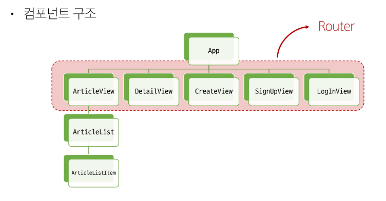
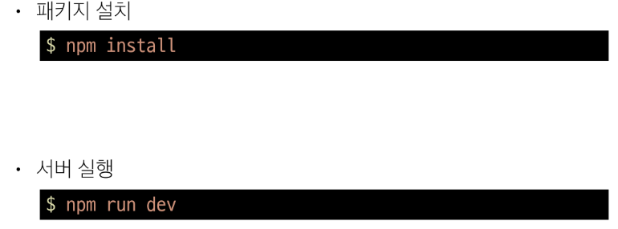
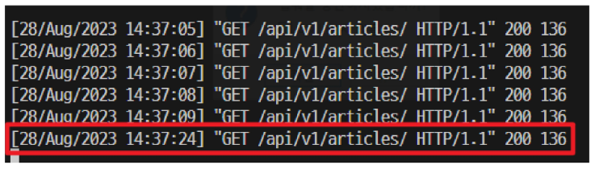

# Vue with DRF
## 프로젝트 개요
### 이틀 동안 진행할 프로젝트
 1. Vue with DRF 1
     - Vue와 DRF 간 기본적인 요청과 응답
 2. Vue with DRF 2
     - Vue와 DRF에서의 인증 시스템

### DRF 프로젝트 안내
 - 스켈레톤 프로젝트 django-pjt 제공
 - 외부 패키지 및 라이브러리는 requirements.txt에 작성되어 있음
 - DRF 프로젝트는 주석을 해제하며 진행

### Skeleton code 살펴보기

 - Model 클래스 확인
  

 - URL 확인
  

 - serializers 확인
  

 - views.py의 import 부분 확인
  

 - view 함수 확인
  

 - settings.py 확인
  
  

 - Fixtures 확인
  

 - 가상환경 생성 및 활성화
 - 패키지 설치
  

 - Migration 진행
 - Fixtures 데이터 로드
  

 - Django 서버 실행 후, 전체 게시글 조회 요청
     - http://127.0.0.1:8000/api/v1/articles/
  

### Vue 프로젝트 안내
 - 스켈레톤 프로젝트 vue-pjy 제공
 - Vite를 사용해 Pinia 및 Vue Router가 추가되어있음
 - pinia-plugin-persistedstate가 설치 및 등록되어있음
 - Vue 프로젝트는 "직접 코드를 작성"하며 진행

 - 컴포넌트 구조
  

 - 프로젝트 구조
  

### Skeleton code 살펴보기
 - App 컴포넌트
  

 - route에 등록된 컴포넌트 (Article, Create, Detail, Login, SignUp)
  

 - ArticleList 컴포넌트
  

 - ArticleListItem 컴포넌트
  

 - routes 현황
  

 - store 현황
  

 - main.js 현황
  

 - 패키지 설치
 - 서버 실행
  

## 메인 페이지 구현
### 시작하기 전에
 - 무결점의 프로젝트를 만드는 것이 아님
 - frontend 프레임워크와 backend 프레임워크 간의 요청과 응답, 그 과정에서 등장하는 새로운 개념과 문제를 해결하면서 하나의 웹 애플리케이션 서비스를 구현하는 과정에 집중할 것

### 개요
 - ArticleView 컴포넌트에 ArticleList 컴포넌트와 ArticleListItem 컴포넌트 등록 및 출력하기
 - ArticleList와 ArticleListItem은 각각 게시글 출력을 담당

### 게시글 목록 출력
 - ArticleView의 route 관련 코드 주석 해제
  

 - App 컴포넌트에 ArticleView 컴포넌트로 이동하는 RouterLink 작성
  

 - ArticleView 컴포넌트에 ArticleList 컴포넌트 등록
  

 - store에 임시 데이터 articles 배열 작성하기
  

 - ArticleList 컴포넌트에서 게시글 목록 출력
 - store의 articles 데이터 참조
 - v-for를 활용하여 하위 컴포넌트에서 사용할 article 단일 객체 정보를 props로 전달

  

 - ArticleListItem 컴포넌트는 내려받은 props를 정의 후 출력
  

 - 메인 페이지에서 게시글 목록 출력 확인
  

### DRF로부터 응답 데이터 받기
 - 이제는 임시 데이터가 아닌 DRF 서버에 요청하여 데이터를 응답 받아 store에 저장 후 출력하기

### DRF와의 요청과 응답
 - DRF 서버로의 AJAX 요청을 위한 axios 설치 및 관련 코드 작성
  

 - DRF 서버로 요청을 보내고 응답 데이터를 처리하는 getArticles 함수
  

 - ArticleView 컴포넌트가 마운트될 때 getArticles 함수가 실행되도록 함
 - 해당 컴포넌트가 렌더링될 때 항상 최신 게시글 목록을 불러오기 위함
  

 - Vue와 DRF 서버를 모두 실행한 후 응답 데이터 확인
 - 에러 발생
  

 - 그런데 DRF 서버 측에서는 문제 없이 응답했음 (200 OK)
 - 서버는 응답했으나 브라우저 측에서 거절한 것
  

 - 브라우저가 거절한 이유
   - localhost:5173에서 127.0.0.1:8000/api/v1/articles/의 XMLHttpRequest에 대한 접근이 CORS policy에 의해 차단되었다.
  

## CORS Policy
### SOP
(same-origin policy) 동일 출처 정책

 - 어떤 출처(origin)에서 불러운 문서나 스크립트가 다른 출처에서 가져온 리소스와 상호 작용하는 것을 제한하는 보안 방식

  - 다른 곳에서 가져온 자료는 일단 막는다.
  - 웹 애플리케이션의 도메인이 다른 도메인의 리소스에 접근하는 것을 제어하여 사용자의 개인 정보와 데이터의 보안을 보호하고, 잠재적인 보안 위협을 방지
  - 잠재적으로 해로울 수 있는 문서를 분리함으로써 공격받을 수 있는 경로를 줄임

### Origin (출처)
 - URL의 Protocol, Host, Port를 모두 포함하여 출처라고 부름
 - Same origin 예시
   - 아래 세 영역이 일치하는 경우에만 동일 출처(same-origin)로 인정
  

 - same origin 예시
   - http://localhost:3000/articles/3/을 기준으로 동일 출처 여부를 비교
  

