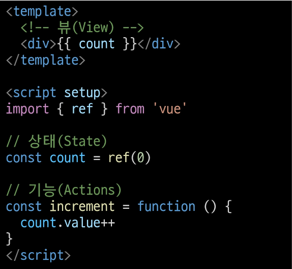
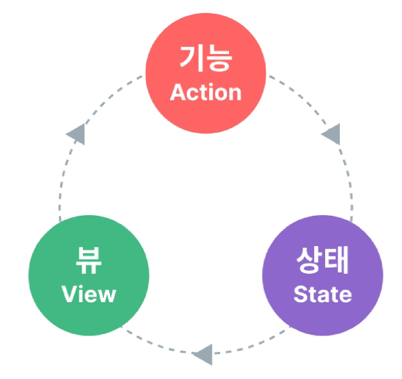
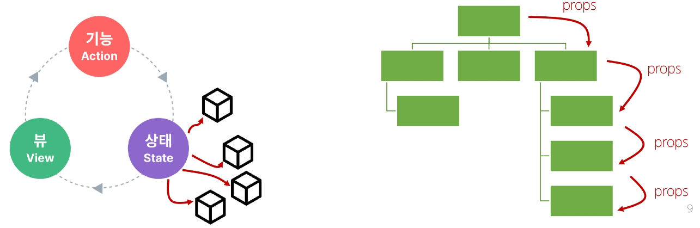
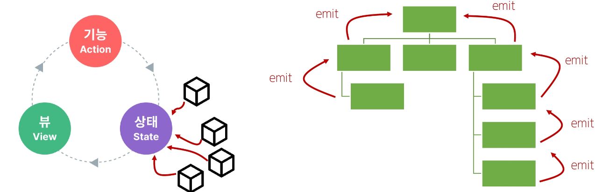
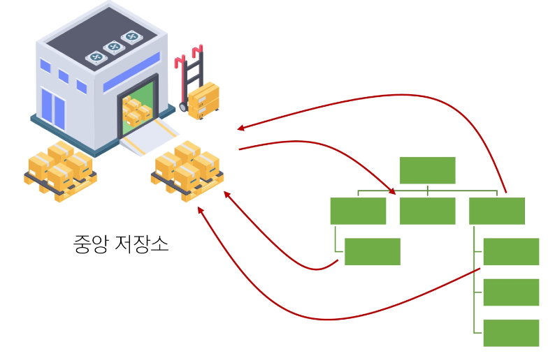
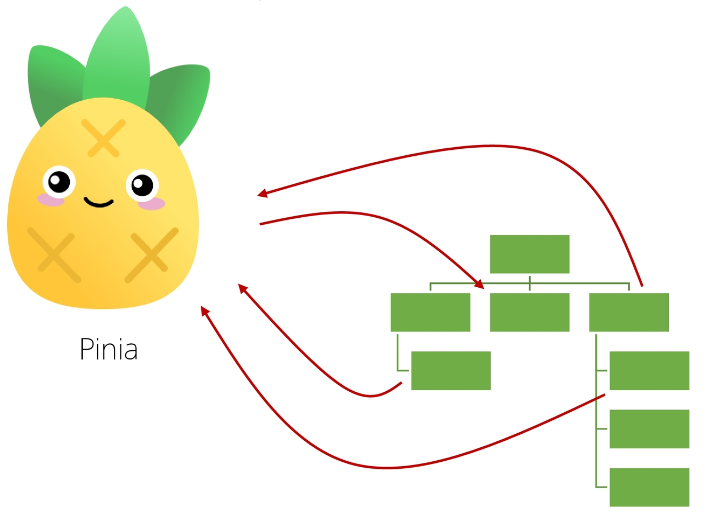
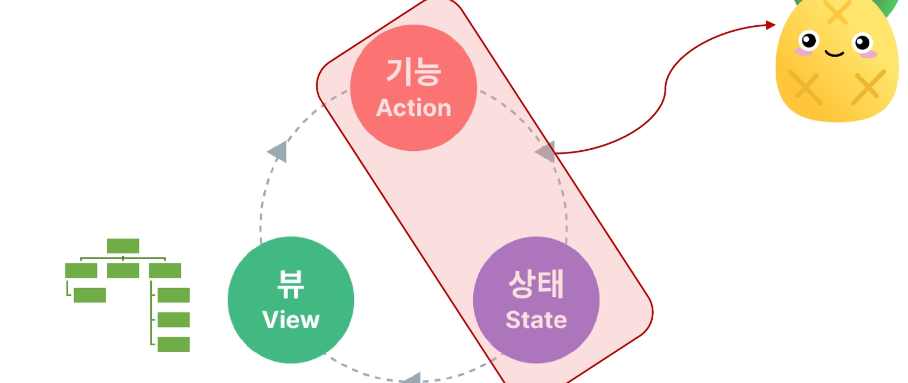
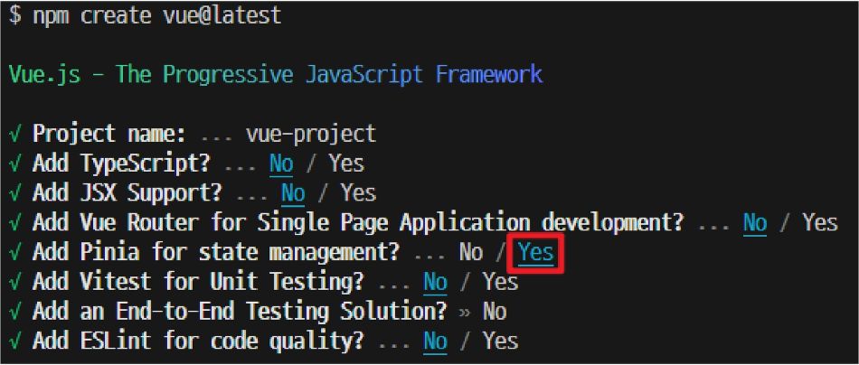
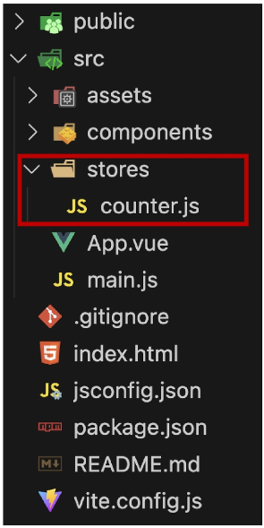

# Vue 07 : State Management
## State Management
### State Management
상태 관리
Vue 컴포넌트는 이미 반응형 상태를 관리하고 있음
 - 상태 === 데이터

### 컴포넌트 구조의 단순화
 - 상태(State)
     - 앱 구동에 필요한 기본 데이터
 - 뷰(View)
     - 상태를 선언적으로 매핑하여 시각화
 - 기능(Actions)
     - 뷰에서 사용자 입력에 대해 반응적으로 상태를 변경할 수 있게 정의된 동작
 

 - 단방향 데이터 흐름의 간단한 표현
 

### 상태 관리의 단순성이 무너지는 시점
 - 여러 컴포넌트가 상태를 공유할 때
     1. 여러 뷰가 동일한 상태에 종속되는 경우
     2. 서로 다른 뷰의 기능이 동일한 상태를 변경시켜야 하는 경우

 1. 여러 뷰가 동일한 상태에 종속되는 경우
     - 공유 상태를 공통 조상 컴포넌트로 "끌어올린" 다음 props로 전달하는 것
     - 하지만 계층 구조가 깊어질 경우 비효율적, 관리가 어려워짐
 

 2. 서로 다른 뷰의 기능이 동일한 상태를 변경시켜야 하는 경우
     - 발신(emit)된 이벤트를 통해 상태의 여러 복사본을 변경 및 동기화하는 것
     - 마찬가지로 관리의 패턴이 깨지기 쉽고 유지, 관리할 수 없는 코드가 됨
 

### 해결책
 - 각 컴포넌트의 공유 상태를 추출하여 전역에서 참조할 수 있는 저장소에서 관리
 

 - 각 컴포넌트의 공유 상태를 추출하여, 전역에서 참조할 수 있는 저장소에서 관리
 

 - 컴포넌트 트리는 하나의 큰 View가 되고 모든 컴포넌트는 트리 계층 구조에 관계 없이 상태에 접근하거나 기능을 사용할 수 있음
 - Vue의 공식 상태 관리 라이브러리 === "Pinia"
 

## State management library(Pinia)
### Pinia
Vue 공식 상태 관리 라이브러리

### Pinia 설치
 - Vite 프로젝트 빌드 시 Pinia 라이브러리 추가
 

### Vue 프로젝트 구조 변화
 - stores 폴더 신규 생성
 

### Pinia 구성 요소
 1. store
 2. state
 3. getters
 4. actions
 5. plugin

### 1. Pinia 구성 요소 - 'store'